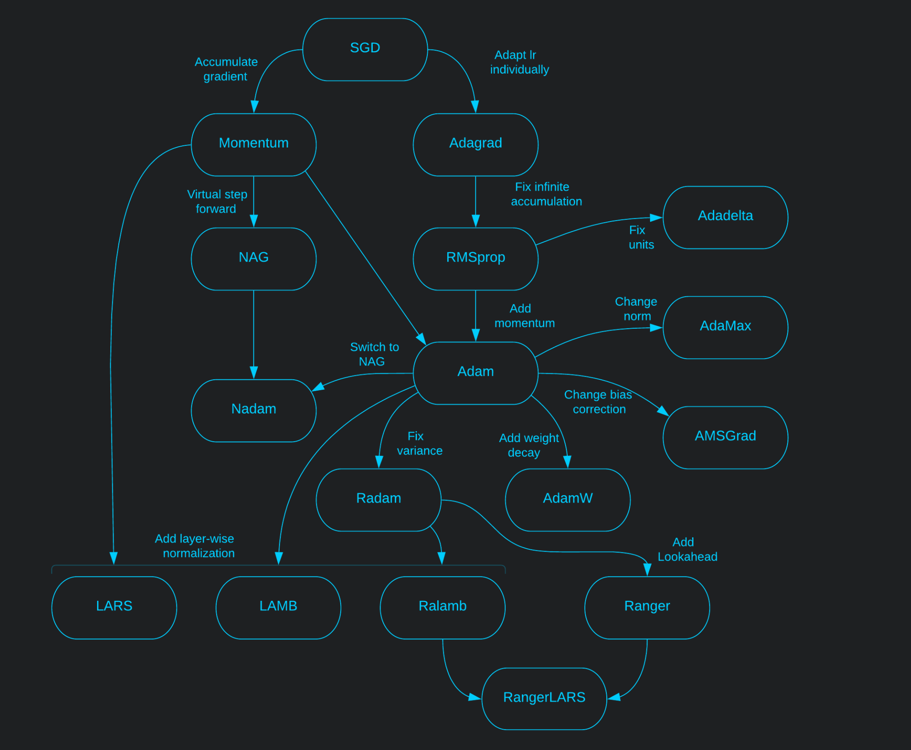
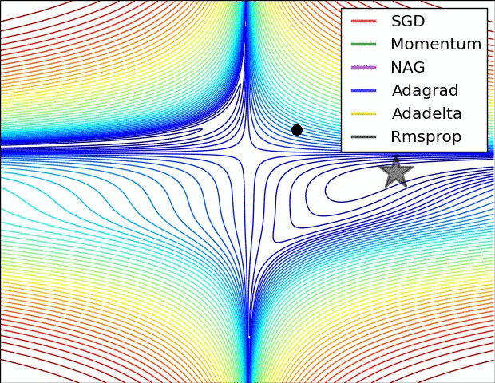

## Basic Gradient Descent Types

:question: How do we find optimal parameters for a network?​

Suppose a model has parameters $$\theta \in \mathbb{R}^d$$ and we use an objective function $$L(\theta)$$ to estimate how close we are to the optimal parameters. As we don't know where the minimum of the loss function is in the parameter space, we repeat small steps in the direction of the fastest decrease in the loss function. This direction is the anti gradient: $$-\nabla_\theta L(\theta)$$ .

:exclamation: Global minimum is guaranteed only for convex error surfaces.

[An overview of gradient descent optimization algorithms](https://ruder.io/optimizing-gradient-descent/)

### Batch Gradient Descent

Uses **all** samples to perform one update.

$$\theta=\theta - \alpha \cdot \nabla_\theta L(\theta)$$

### Stochastic Gradient Descent (SGD)

Uses **one** sample to perform one update.

$$
\theta=\theta - \alpha \cdot \nabla_\theta L(\theta, x_i, y_i)
$$

- Fast, may escape local minimum
- Need to use learning rate decay for better conversion
- Need to shuffle data to provide randomness

### Mini-batch Gradient Descent

Uses  **k** samples to perform one update.

$$
\theta=\theta - \alpha \cdot \nabla_\theta L(\theta, x_{i:i+k}, y_{i:i+k})
$$

- More stable convergence compared to SGD

## Visualization

### Convergence

### Saddle point

## Momentums

### Momentum

:question: What if we immitate a ball rolling down the hill?

$$
g_{t}=\gamma g_{t-1} + \alpha \nabla_\theta L(\theta)
$$

$$
\theta = \theta - g_t
$$

$$\gamma$$ is usually 0.9

- Reduces oscillation and converges faster

### Nesterov Accelerated Gradient (NAG)

:question: Can we get a smarter ball that knows when it's time to slow down?

Let's make a virtual step in the direction of the momentum first $$\theta - \gamma g_{t-1}$$ and calculate the value of the gradient from that point instead of $$\theta$$.

$$
g_{t}=\gamma g_{t-1} + \alpha \nabla_\theta L(\theta-\gamma g_{t-1})
$$

$$
\theta = \theta - g_t
$$

## Adaptive Optimizers

### Adagrad

:question: Shouldn't infrequent features get larger updates?

:exclamation: Let's adapt lr for each parameter separately.

Suppose we have $$p$$ parameters. We will store history for parameter updates until step $$t$$ in a diagonal matrix $$G_t \in \mathbb{R}^{p \times p}$$ with diagonal elements defined as $$G_{t,ii}=\sum_{k=0}^t(\nabla_\theta L(\theta_{k,i}))^2$$.

$$
g_t=\frac{1}{\sqrt{G_t+\epsilon}}\odot \alpha\nabla_\theta L(\theta)
$$

$$
\theta = \theta - g_t
$$

$$\epsilon \approx 1e-8$$ Is to avoid division by zero.

- No need to tune learning rate
- Unlimited accumulation of the squared gradients causes lr to become very small.

### RMSprop

:question: Why have we decided to store infinite gradient history in Adagrad in the first place?

:exclamation:Change to exponential moving average. 	

$$
W_t=\rho W_{t-1}+(1-\rho)(\nabla_\theta L(\theta_t))^2
$$

$$
g_t=\frac{1}{\sqrt{W_t+\epsilon}}\odot\alpha \nabla_\theta L(\theta)
$$

$$
\theta = \theta - g_t
$$

- $$\rho$$ proposed as 0.9, $$\alpha$$ as 0.001

### Adadelta

:question: If parameters had units, shouldn't we've had used the same units to update it?

This was invented independently from RMSprop, but the first thing authors do to fix Adagrad is the same thing that RMSprop does.

$$
W_t=\rho W_{t-1}+(1-\rho)(\nabla_\theta L(\theta_t))^2
$$

$$
g_t=\frac{1}{\sqrt{W_t+\epsilon}}\odot\alpha \nabla_\theta L(\theta)
$$

Atm update is unitless. Let's add virtual units back by bringing in exponentially decaying window of squared parameters. Also eliminate learning rate because it will be balanced by this new part.

$$
P_t=\rho P_{t-1} + (1-\rho)(\theta_t-\theta_{t-1})^2
$$

$$
g_t=\frac{\sqrt{P_{t-1}+\epsilon}}{\sqrt{W_t+\epsilon}}\odot \nabla_\theta L(\theta)
$$

$$
\theta = \theta - g_t
$$

- No learning rate at all.

### Adam

:question: Why not add adaptive momentum to RMSprop?

Let's estimate momentum and variance. Note that $$v_t$$ is the same thing as $$W_t$$ in Adadelta and RMSprop.

$$
m_t = \beta_1 m_{t-1} + (1-\beta_1)\nabla_\theta L(\theta_t)
$$

$$
v_t = \beta_2 v_{t-1} + (1-\beta_2)(\nabla_\theta L(\theta_t))^2
$$

If $$\beta$$ is close to 1, these values are biased towards initial value of zero. This is fixed by transforming into:

$$
\hat{m}_t=\frac{m_t}{1-\beta_1^t}
$$

$$
\hat{v}_t=\frac{v_t}{1-\beta_2^t}
$$

Finally the update rule is:

$$
\theta=\theta-\alpha\frac{\hat{m}_t}{\sqrt{\hat{v}_t}+\epsilon}
$$

### AdaMax

:question: Let's change Adam's  $$l_2$$ normed $$v_t$$ to $$l_\infty$$ normed $$u_t$$

$$
u_t = \beta_2^\infty u_{t-1} + (1-\beta_2^\infty)|\nabla_\theta L(\theta_t)|^\infty=max(\beta_2u_{t-1}, |\nabla_\theta L(\theta_t)|)
$$

$$\hat{m}_t$$ Is the same as in Adam.

$$
\theta=\theta-\alpha \frac{\hat{m}_t}{u_t}
$$

### Nadam

:question: Why use vanilla momentum in Adam when we have NAG?

But instead of using lookahead step we will use it to update parameters in advance.

Let's start with Adam rule:

$$
\theta=\theta-\alpha\frac{\hat{m}_t}{\sqrt{\hat{v}_t}+\epsilon}
$$

Now add lookahead for $$\hat{m}_t$$.

$$
\theta=\theta-\frac{\alpha}{\sqrt{\hat{v}_t}+\epsilon}\Big(\beta_1\hat{m}_t+\frac{(1-\beta_1)\nabla_\theta L(\theta_t)}{1-\beta_1^t}\Big)
$$

## Improving Adam

[2017 post](https://ruder.io/deep-learning-optimization-2017/index.html)

### AMSGrad

:question: Why is Adam sometimes outperformed by SGD+Momentum?

:exclamation: Moving average treats rare good batches the same as all the other ones.

Accumulate $$m_t$$ and $$v_t$$ as in Adam.

$$
m_t = \beta_1 m_{t-1} + (1-\beta_1)\nabla_\theta L(\theta_t)
$$

$$
v_t = \beta_2 v_{t-1} + (1-\beta_2)(\nabla_\theta L(\theta_t))^2
$$

But throw away bias correction for $$m_t$$ and change it for $$v_t$$ as

$$
\hat{v}_t=max(\hat{v}_{t-1}, v_t)
$$
This way update steps will become non-increasing.

$$
\theta=\theta-\alpha\frac{m_t}{\sqrt{\hat{v}_t}+\epsilon}
$$
Results in practice differ and its not clear if this method really outperform Adam.

### AdamW

:question: Why is Adam sometimes outperformed by SGD+Momentum?

:exclamation: Add weight decay $$w_t$$.

$$
\theta=\theta-\alpha\frac{\hat{m}_t}{\sqrt{\hat{v}_t}+\epsilon} - \alpha w_t \theta
$$

- improves generalization
- decouples the choice of the learning rate from the choice of the weight decay

### Radam

- [On the Variance of the Adaptive Learning Rate and Beyond](https://arxiv.org/abs/1908.03265) :page_facing_up: 

- [Medium post](https://medium.com/@lessw/new-state-of-the-art-ai-optimizer-rectified-adam-radam-5d854730807b)
- [Code](https://github.com/LiyuanLucasLiu/RAdam)

:question: Why does warmup (initial period of training with very low lr) helps adaptive optimizers reach better minimums?

:exclamation: It removes excessive variance when momentum has not yet seen enough data to make reliable jumps. But we can add a rectifier term $$r_t$$ to control this.

To compute a rectifier term we first need to compute the lenght of approximated simple moving average. $$\rho_\infty$$ is the maximum length of SMA.

$$
\rho_\infty=\frac{2}{1-\beta_2}-1
$$

$$
\rho_t=\rho_\infty-\frac{2t\beta_2^t}{1-\beta_2^t}
$$

If the variance is tractable ( $$\rho_t>4$$ ) then

$$
r_t=\sqrt{\frac{(\rho_t-4)(\rho_t-2)\rho_\infty}{(\rho_\infty-4)(\rho_\infty-2)\rho_t}}
$$

$$
\theta=\theta-\alpha r_t\frac{\hat{m}_t}{\sqrt{\hat{v}_t}+\epsilon}
$$

else use un-updated momentum

$$
\theta=\theta-\alpha\hat{m}_t
$$

## Dynamic Bound methods

- [Adaptive Gradient Methods With Dynamic Bound Of Learning Rate](https://openreview.net/pdf?id=Bkg3g2R9FX) :page_facing_up:

### AdaBound

[Code](https://github.com/Luolc/AdaBound)

### AMSBound

## Wrapper methods

These methods are applied to a base optimizer $$A$$ to improve its performance.

### Large Batch Optimization

- [Large Batch Optimization for Deep Learning: Training BERT in 76 minutes](https://arxiv.org/abs/1904.00962) :page_facing_up:

- [Towards DS post](https://towardsdatascience.com/an-intuitive-understanding-of-the-lamb-optimizer-46f8c0ae4866)

  :question: How to adapt learning rate in large batch settings?

  :exclamation: Use **layer-wise** normalization.

  Suppose we have base optimizer $$A$$ computes layer-wise update $$u_t$$ and applies it with the following update rule
  
  $$
  \theta=\theta-\alpha u_t
  $$

Change update with

- Normalize update to **layer-wise** unit $$l_2$$-norm $$\frac{u_t}{\|{u_t}\|}$$
- Scale learning rate **layer-wise** with $$\phi(\|\theta\|)$$,  $$\phi: \mathbb{R}^+ \to \mathbb{R}^+$$. 

#### LARS

LARS uses Momentum with weight decay as a base optimizer.

$$
m_t=\beta_1m_{t-1}+(1-\beta_1)(\nabla_\theta L(\theta)+\lambda \theta_t)
$$

Layer-wise:

$$
\theta=\theta-\alpha \phi(\|\theta\|)\frac{m_t}{\|m_t\|}
$$

#### LAMB

LAMB uses Adam with weight decay as a base optimizer.

Suppose $$r_t=\frac{\hat{m}_t}{\sqrt{\hat{v}_t}+\epsilon}$$ is an update term from Adam

Layer-wise:

$$
\theta=\theta-\alpha\phi(\|\theta\|)\frac{r_t+\lambda \theta}{\|r_t+\lambda \theta\|}
$$

### Lookahead

- [Lookahead Optimizer: k steps forward, 1 step back](https://arxiv.org/abs/1907.08610) :page_facing_up: 

:question: What if we first make some fast exploration steps to check what's there and then combine it with slow conservative weights?

Let $$\phi$$ be a set of fast weights and $$\theta$$ a set of slow weights. Fast weights are updated with any optimizer algorithm $$A$$. First we do $$k$$ exploration steps with fast weights $$\phi$$. Then we update slow weights with

$$
\theta=\theta-\alpha(\phi-\theta)
$$

and sync fast weights with slow weights $$\phi=\theta$$.

- fast weights can use bigger learning rate

### Combinations

Radam + Lookahead = [Ranger](https://medium.com/@lessw/new-deep-learning-optimizer-ranger-synergistic-combination-of-radam-lookahead-for-the-best-of-2dc83f79a48d) ([code](https://github.com/lessw2020/Ranger-Deep-Learning-Optimizer))

Radam + LARS = [Ralamb](https://gist.github.com/redknightlois/c4023d393eb8f92bb44b2ab582d7ec20)

Radam + LARS + Lookahead = [RangerLARS](https://github.com/mgrankin/over9000)